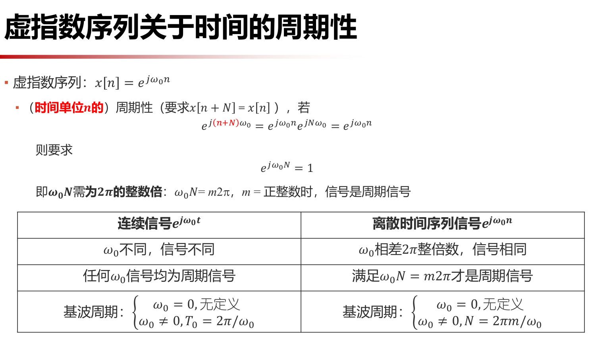

---

layout: post 

title: 数字信号处理

---
[lamda](https://www.lamda.nju.edu.cn/yehj/dsp2021/?AspxAutoDetectCookieSupport=1)

## Introduciton

信号的分类

- 输入：连续信号，离散信号
- 输出：模拟信号，数字信号
- 确定信号，随机信号

- 时域：以时间为自变量描述信号与系统
- 频率
- 频域：以频率为自变量描述信号与系统，如果不以频率为自变量成为变换域
- 频谱： 信号的频域表示，描述信号各分频率的幅度和相位

基波周期

## 信号的时域分析

- 周期信号𝑥(𝑡)，𝑦(𝑡)的周期为𝑇1 和𝑇2 ，若周期之比𝑇1 /𝑇2 为有理数，则其和信号𝑥(𝑡) + 𝑦(𝑡)仍然是周期信号，其周期为𝑇1 和𝑇2 的最小公倍数。

$x_1(t)=sin2t+cos3t,T=2\pi$

- 两连续周期信号之和不一定是周期信号，而两周期序列之和一定是周期序列。
- 正弦序列不一定是周期序列

**能量信号与功率信号**

$W=\displaystyle\lim_{T \to \infin} \int_{-T}^{T}|x(t)|^2dt$

$P = \displaystyle \lim_{T \to \infin} \frac{1}{2T} \int_{-T}^{T} |x(t)|^2dt,\ P= \displaystyle \lim_{N \to \infin}\frac{1}{2N+1}\sum_{-N}^{N}|x(n)|^2$

能量信号功率为0,能量是有限的

功率信号能量无限，功率有限

- 信号可能即不是功率信号，也不是功率信号
- 周期信号都是功率信号

 因果信号：$t>0, x(t)\ne 0$, 其余时候都为0

抽样信号： sint/t

- 虚指数列不具有随着$\omega$增大而增加震荡速率的性质

- 单位脉冲
- 单位阶跃
- 奇异信号：本身或者导数具有不连续点（单位斜变信号）
- 冲激信号
- 冲激信号可用于表示其他任意信号或表示信号间断点的导数

微分突出了变化的部分，进行了锐化

积分使得尖锐的部分变平滑了，进行了模糊，可以削弱噪声的影响

帕赛瓦尔定理：信号的功率等于完备正交函数集中各分量功率的和
